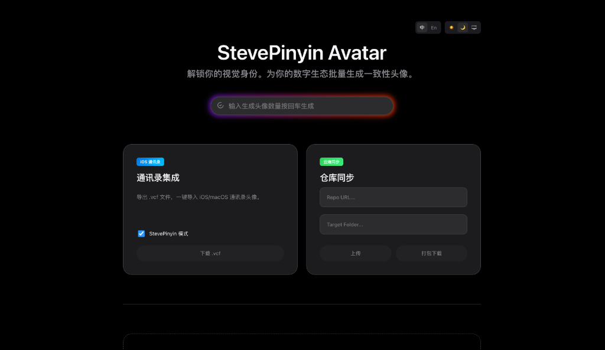
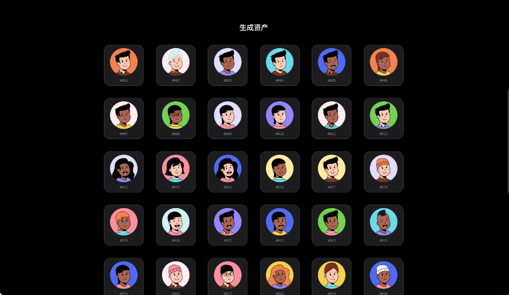

# StevePinyin Avatar Studio

一个拥有极致 UI 体验的头像批量生成器。融合了 **Apple Intelligence** 的流光美学未来感交互。





> **Unlock your visual identity.**  
> 为你的数字生态批量生成一致性头像，支持从本地到云端的无缝同步。

## ✨ 核心特性 (Features)

### 1. 极致 UI & 交互
- **统一指令栏 (Unified Command Bar)**：极简设计，输入数字 + 回车 (Enter) 即可生成，摒弃繁杂按钮。
- **Siri Wave 光效**：输入框聚焦时呈现多彩流动的 Siri 风格光晕。
- **暗黑模式 (Dark Mode)**：完美适配系统深色模式，提供沉浸式体验。
- **国际化 (i18n)**：支持中/英双语实时切换。

### 2. 批量生成引擎
- **高性能**：基于 `react-nice-avatar`，瞬间生成 1-500+ 个独一无二的矢量风格头像。
- **智能预览**：网格化布局，实时查看生成结果。

### 3. 多元导出方案
- **iOS 通讯录深度集成 (.vcf)**：
  - 一键导出标准 vCard 3.0 文件。
  - **StevePinyin 模式**：优化图像格式，使其在 iOS 来电界面全屏显示。
- **StevePinyin 专属包**：
  - 导出包含 `config.json` 的 ZIP 包，直接适配 StevePinyin App 生态。

### 4. GitHub 云端同步 ☁️
- **一键发布**：将生成的头像直接 Push 到指定的 GitHub 仓库。
- **自定义路径**：支持自定义 Repo URL 和目标文件夹 (Target Folder)。
- **自动化配置**：自动生成索引文件，充当静态资源服务器。

---

## 🚀 快速开始 (Getting Started)

### 环境要求
- Node.js (v16+)
- Git (需配置好 SSH 或 Token 权限)

### 安装步骤

1. **克隆项目**
   ```bash
   git clone https://github.com/your-username/avatar-exporter.git
   cd avatar-exporter
   ```

2. **安装依赖**
   ```bash
   npm install
   ```

### 启动项目

项目使用了并发运行命令，只需一条指令即可同时启动前端 (Vite) 和后端 (Express) 服务：

```bash
npm run dev
```

- **前端页面**: 打开浏览器访问 `http://localhost:5173`
- **后端 API**: 运行在 `http://localhost:3000`

---

## 📖 使用指南 (Usage Guide)

### A. 生成头像
1. 在顶部的 **指令栏** 输入想要生成的数量 (例如 `50`)。
2. 直接按下 **回车键 (Enter)**。
3. 欣赏 Siri Wave 光效带来的生成过程。

### B. 导入 iPhone 通讯录
1. 勾选 **StevePinyin Mode** (推荐，支持全屏来电)。
2. 点击 **下载 .vcf**。
3. 将文件 AirDrop (隔空投送) 到 iPhone，选择 "添加所有联系人"。

### C. 同步到 GitHub
1. 在下方卡片中输入目标仓库地址 (Repo URL)。
2. (可选) 输入目标文件夹名 (Target Folder)。
3. 点击 **上传 (Upload)** 即可自动完成 `git push` 流程。

---

## 🛠 技术栈 (Tech Stack)

- **Frontend**: React, Vite
- **Styling**: Vanilla CSS (CSS Variables, Keyframes Animations)
- **UI Effects**: Apple Intelligence Glow, Glassmorphism
- **Backend**: Express.js, `simple-git`
- **Libraries**: `react-nice-avatar`, `dom-to-image`, `jszip`

## ⚠️ 注意事项

- 确保本地终端具有访问 GitHub 的权限 (建议配置 SSH Key)。
- 后端服务运行在本地，用于处理文件系统和 Git 操作，请勿在无保护的公网环境暴露端口。


---

## 🖼️ 界面预览 (Preview)

### 沉浸式暗黑模式


### 批量生成网格


---

## ❤️ 致谢 (Credits)

本项目核心的头像生成能力由以下开源项目驱动：

- **[react-nice-avatar](https://github.com/dapi-labs/react-nice-avatar)**: By **dapi-labs**. 提供了极其丰富且可爱的头像 SVG 组件库。

没有他们的精彩工作，就没有 StevePinyin Avatar Studio 的诞生。

---

*Build with ❤️ by SteveZhou*
